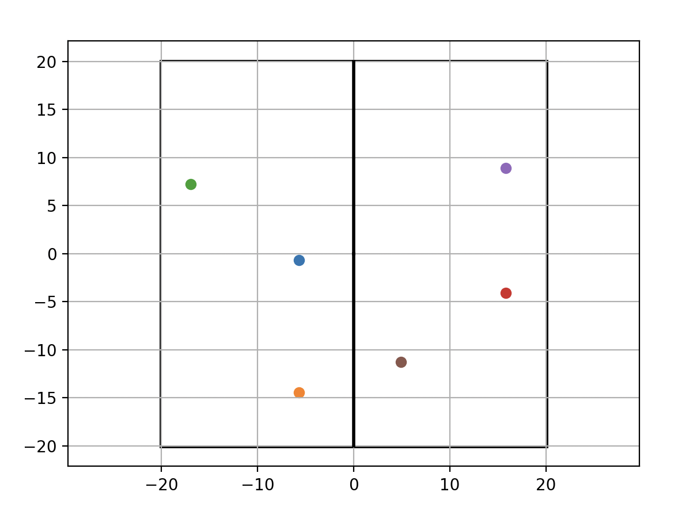

# Triangle Generator and Plotter

This project generates random sets of three points (`p1`, `p2`, `p3`) that form triangles within specified spatial bounds. These coordinates were then used for the development of a Virtual Reality (VR) environment in Unity for experimentation to study episodic memory in human research subjects.

The points are constrained to lie on either the **left** or **right** side of the coordinate plane, and the angle at the first point (`p1`) is forced into a configurable range (default: 90–130°). The code can visualize the results using Matplotlib.

---

## Features
- Generate random coordinates within bounding boxes.
- Ensure the first two points are **parallel** (same x or same y) and at least a minimum distance apart.
- Create third points on a circle around `p1` and filter them by:
  - Spatial bounds
  - Angle constraint (default: 90°–130° at `p1`)
- Separate generation for left-side and right-side triangles.
- Plot points and bounding boxes using Matplotlib.

## Example Output



Three coordinates on each side of the square, fitting spacial bounds between the each point and from the environment walls, as well as matching angle parameters.

---

## Requirements
- Python 3.9+
- Libraries:
  - `numpy`
  - `matplotlib`

Install dependencies with:

```bash
pip install numpy matplotlib
```

---

## Usage

Run the project with:

```bash
python squareCoordinates.py
```

### Example output
- Printed coordinates for left and right triangles
- A Matplotlib plot showing:
  - Left triangle points (within left x-bounds)
  - Right triangle points (within right x-bounds)
  - Bounding square and axis lines

---

## Configuration
Key parameters are defined at the top of `squareCoordinates.py`:

```python
LEFT_X_BOUNDS = (-17.135, -3.0)
RIGHT_X_BOUNDS = (3.0, 17.135)
Y_BOUNDS = (-17.135, 17.135)
MIN_DIST = 11
MIN_POINTS = 230
ANGLE_RANGE = (90, 130)
NUM_CIRCLE_POINTS = 1000
MAX_ATTEMPTS = 1000
```

- **Bounds**: Define where left/right points may appear.
- **MIN_DIST**: Minimum separation between the first two points.
- **ANGLE_RANGE**: Acceptable angle range at `p1`.
- **NUM_CIRCLE_POINTS**: Number of candidate points sampled on the circle.
- **MAX_ATTEMPTS**: Safety limit to avoid infinite loops.

---

## Project Structure
- `squareCoordinates.py` — main script with functions for point generation, filtering, and plotting.
- **Core functions**:
  - `get_random_coordinates()` — generates parallel points at least `MIN_DIST` apart.
  - `get_circle_points()` — samples candidate third points on a circle.
  - `get_points_in_bounds()` — filters points to fit bounds.
  - `get_angle()` — computes angle at `p1`.
  - `squareCoordinates()` — main driver that returns a valid triangle `(p1, p2, p3)`.
  - `plot_points()` — visualizes results.

---

## Example

Console output:

```
left triangle: [(-9.23, -7.49), (-9.23, 9.79), (-10.11, 5.42)]
right triangle: [(12.63, 8.64), (12.63, -10.52), (14.32, -2.16)]
```

Plot:

- Black vertical line at x=0
- Square bounding box
- Scatter points for left and right triangles